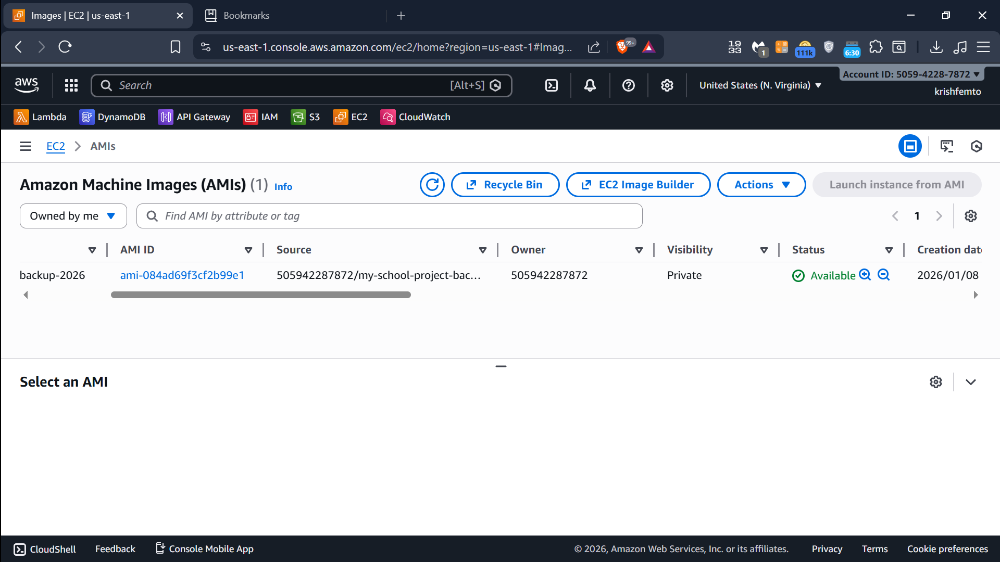
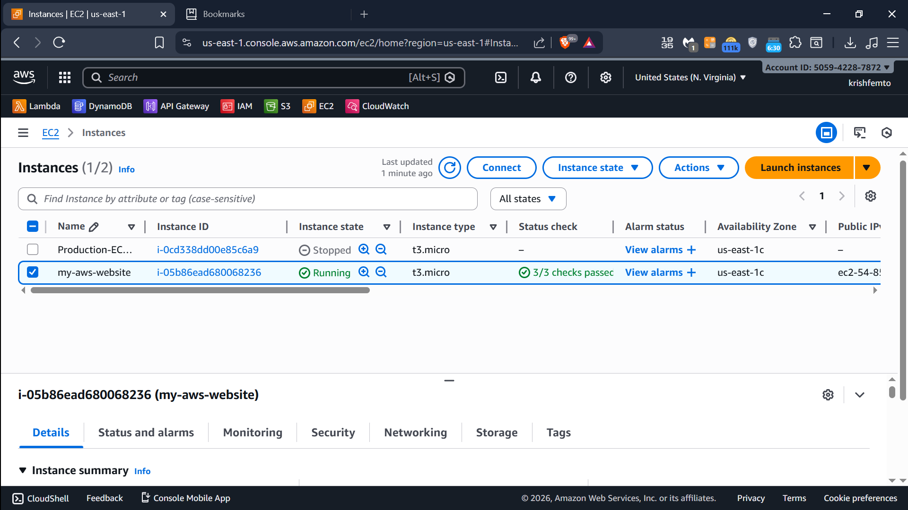
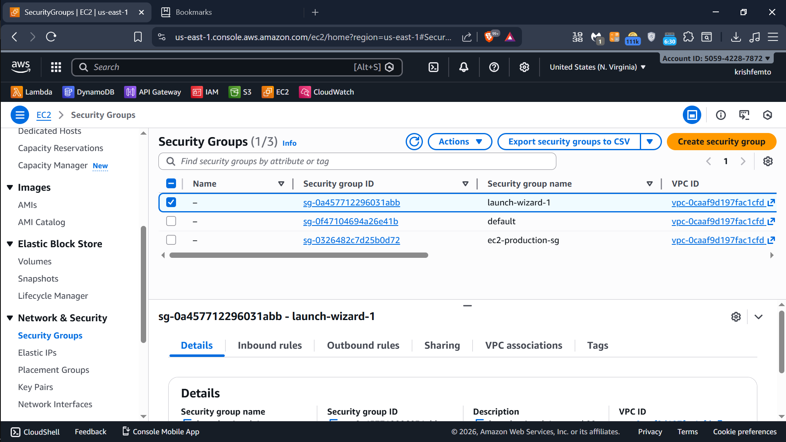
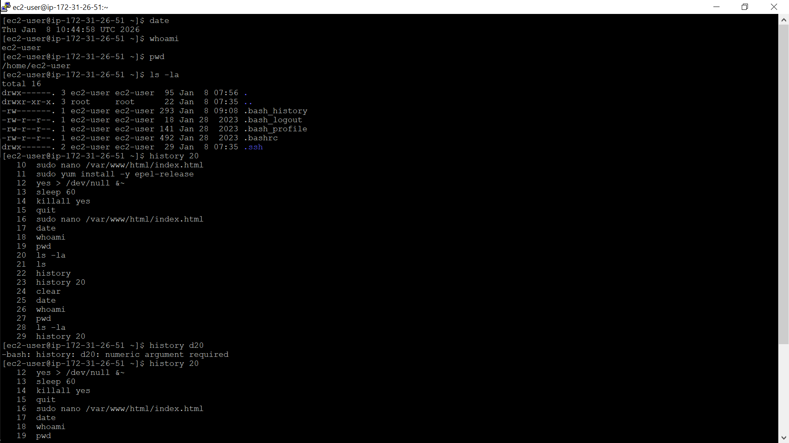
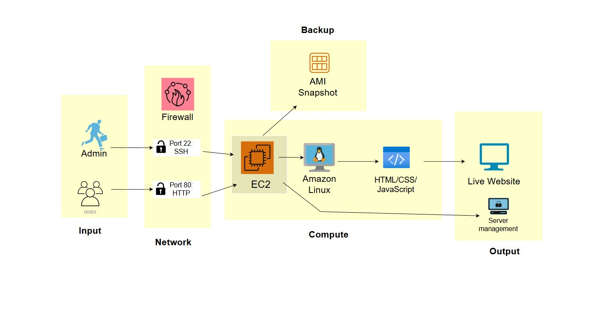

# 🚀 AWS EC2 Web Server Project

**🌐 Languages:** [English](README.md) | [日本語 (Japanese)](README.jp.md)

---

[👉 **View Japanese Version**](README.jp.md)

*Continue with your English content below...*

## 📋 Overview
Complete deployment of a secure, production-ready web server on AWS EC2 using Free Tier.

## 🌐 Live Demo
**Website:** http://54.85.190.169

## 🛠️ What I Built
1. **AWS Infrastructure:** EC2 t3.micro instance (Free Tier)
2. **Web Server:** Apache HTTP server on Amazon Linux 2023  
3. **Security:** Restricted SSH access, proper firewall rules
4. **Backup:** Created AMI snapshot for disaster recovery
5. **Monitoring:** Basic system health checks implemented

## 📸 Proof of Work (7 Screenshots)

### Linux & SSH Proof:

### Live Website:

### AWS Infrastructure:

### Linux Server Proof:

### Architecture Design:

## 🐧 Linux Server Details
- **OS:** Amazon Linux 2023
- **Web Server:** Apache HTTPD 2.4
- **Connected via:** PuTTY (SSH)
- **Commands Executed:** systemctl, ls, df, netstat, cat, etc.
- **User:** ec2-user with sudo privileges

## 🎯 Skills Demonstrated
- AWS EC2 deployment & management
- Linux server administration (real terminal commands)
- Apache web server configuration
- Network security implementation
- Backup & recovery procedures
- Documentation & architecture design

## 📝 Notes
- All work done using **AWS Free Tier** (no cost)
- Project completed: January 2026
- Live website accessible globally
- SSH access restricted to specific IP only
- Full system backup created (AMI snapshot)
